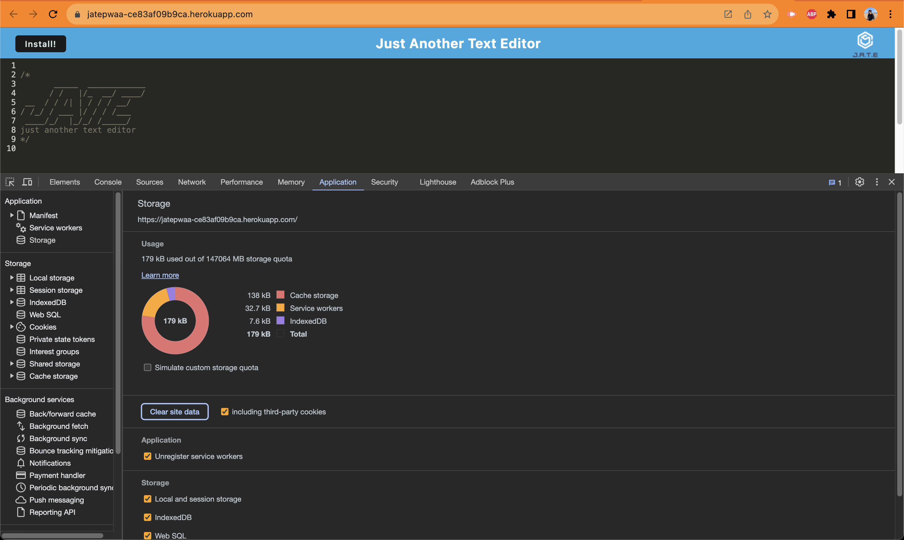

# Text Editor 
Progressive Web Applications (PWA): Text Editor

## Badges

## User Story

AS A developer
I WANT to create notes or code snippets with or without an internet connection
SO THAT I can reliably retrieve them for later use

## Description

This is a simple text editor that allows you to create, edit, and delete notes. It is a progressive web application that allows you to use it offline. It is deployed on Heroku and uses MongoDB Atlas for the database. 

## Table of Contents

* [Installation](#installation)
* [Usage](#usage)
* [Resources](#resources)
* [License](#license)

## Application Screenshot

Follow the link below to see a video walkthrough of the application: 

## Installation

To use this application on device, run the following command:

\`\`\`

1. npm install 

2. npm run build 

3. npm run start:dev

4. open http://localhost:3000 to see application

\`\`\`

## Usage

To use this application, follow the link below:

[Deployed Application](https://jatepwaa-ce83af09b9ca.herokuapp.com/)

## Resources 

* [Heroku](https://www.heroku.com/)
* [MongoDB Atlas](https://www.mongodb.com/cloud/atlas)
* [Node.js](https://nodejs.org/en/)
* [Express.js](https://expressjs.com/)
* [Mongoose](https://mongoosejs.com/)
* [Webpack](https://webpack.js.org/)
* [Babel](https://babeljs.io/)

Special thanks my Professor, TA, and Tutor for their help with this project.

## License

This project is licensed under the [MIT](./LICENSE) license.

